# Conditional Clip-Guided Diffusion

This project is based on Clip-Guided Diffusion by [RiversHaveWings](https://twitter.com/RiversHaveWings)

This diffusion model is ultimately meant for image generation via [DALLE-pytorch](https://github.com/lucidrains/DALLE-pytorch/) by replacing the VAE decoder. By itself, it can perform text-guided image-to-image translation. In this application the overall structure of the original image is preserved, while the details are re-generated with clip guidance. This repository also contains a separate model for clip-guided super-resolution from 64x64 to 256x256

more details at this [github discussion](https://github.com/lucidrains/DALLE-pytorch/discussions/375)

# Sample generations

images from Unsplash

reconstruction from 256x16x16 latents (best out of 8)

| Ground truth | GumbelVQ f8 | CCGD | CCGD + clip | CCGD + clip | CCGD + clip |
| --- | --- | --- | --- | --- | --- |
| </img> | </img> | </img> | </img> | </img> | </img> |
| &nbsp; | &nbsp; | &nbsp; | <sub>Prompt: a girl</sub> | <sub>Prompt: a smiling girl</sub> | <sub>Prompt: a girl with blonde hair</sub> |
| </img> | </img> | </img> | </img> | </img> | </img> |
| &nbsp; | &nbsp; | &nbsp; | <sub>Prompt: a DSLR camera</sub> | <sub>Prompt: a Canon DSLR camera</sub> | <sub>Prompt: a Nikon DSLR camera</sub> |
| </img> | </img> | </img> | </img> | </img> | </img> |
| &nbsp; | &nbsp; | &nbsp; | <sub>Prompt: a cute dog</sub> | <sub>Prompt: a vicious wolf</sub> | <sub>Prompt: a cat </sub> |

it can also be used to "clean up" images created by other VAE models

| OpenAI VAE (32x32 latent) | CCGD re-generated | VQGAN f16 16k (16x16 latent) | CCGD re-generated | VQGAN f16 1k (16x16 latent) | CCGD re-generated |
| --- | --- | --- | --- | --- | --- |
| 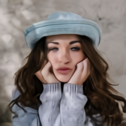</img> | 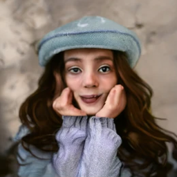</img> | 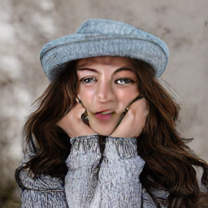</img> | 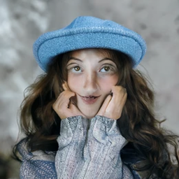</img> | 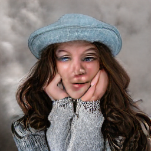</img> | 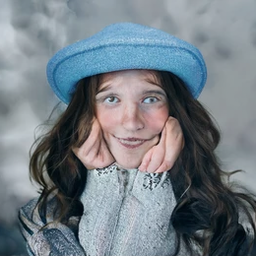</img> |
| 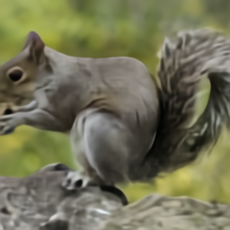</img> | 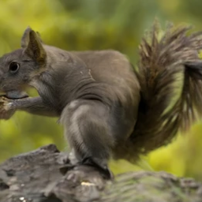</img> | 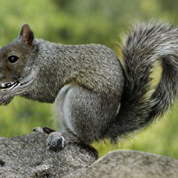</img> | 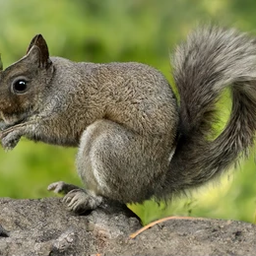</img> | 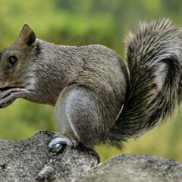</img> | 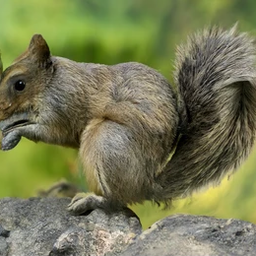</img> |
| 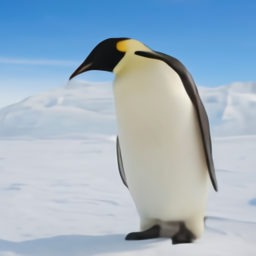</img> | 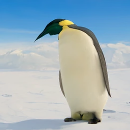</img> | 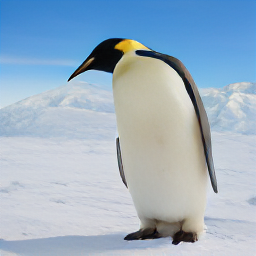</img> | 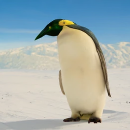</img> | 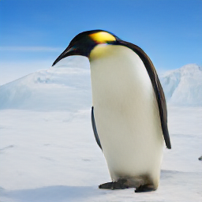</img> | 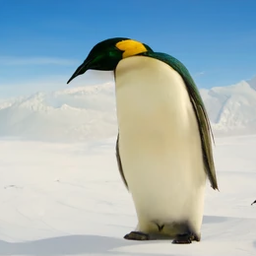</img> |

# Download models

https://dall-3.com/models/guided-diffusion/256/model-latest.pt

Super-resolution, and other experimental files:
https://dall-3.com/models/guided-diffusion/

# Installation

You will need to install [CLIP](https://github.com/openai/CLIP) and [DALLE-pytorch](https://github.com/lucidrains/DALLE-pytorch/)

then clone this repository and
```
pip install -e .
```

# Sampling from dall-3 models

To sample from these models, you can use the `sample.py`, and `super_res.py` scripts in the root directory.

```
# first download the GumbelVQ model
mkdir -p models/vqgan_gumbel_f8/configs && wget 'https://heibox.uni-heidelberg.de/f/b24d14998a8d4f19a34f/?dl=1' -O 'models/vqgan_gumbel_f8/configs/model.yaml' 
mkdir -p models/vqgan_gumbel_f8/checkpoints && wget 'https://heibox.uni-heidelberg.de/f/34a747d5765840b5a99d/?dl=1' -O 'models/vqgan_gumbel_f8/checkpoints/last.ckpt' 

# download latest diffusion model
wget https://dall-3.com/models/guided-diffusion/256/model-latest.pt -O 'models/model-latest.pt'

# run diffusion (input can be image or npy file - a .npy file should contain the image tokens)
python sample.py --model_size 256 --input 0.npy --text "your prompt here"

# 4x super resolution to 1024px
wget https://dall-3.com/models/guided-diffusion/64_256/model016000.pt -O 'models/model-super-res.pt'
python super_res.py --output_size 1024 --input input.png

```

# Sampling from ru-dalle tokens
```
# ru-dalle diffusion (input can be image or npy file - a .npy file should contain the image tokens from ru-dalle. This needs ru-dalle to be installed)
wget https://dall-3.com/models/guided-diffusion/ru-dalle/model-ru-latest.pt -O 'models/model-ru-latest.pt'
python ru.py --input 0.npy

```

# Training

You can use the original OpenAI models to train from scratch, or continue training from the models in this repo by putting the modelXXX, emaXXX and optXXX files in the OPENAI_LOGDIR directory

note the new flags --emb_condition and --lr_warmup_steps


 * 64x64 model:

```
MODEL_FLAGS="--attention_resolutions 32,16,8 --emb_condition True --class_cond False --diffusion_steps 1000 --dropout 0.1 --image_size 64 --learn_sigma True --noise_schedule cosine --num_channels 192 --num_head_channels 64 --num_res_blocks 3 --resblock_updown True --use_new_attention_order True --use_fp16 True --use_scale_shift_norm True"
TRAIN_FLAGS="--lr 1e-4 --lr_warmup_steps 1000 --batch_size 70 --microbatch 35 --log_interval 1 --save_interval 2000 --resume_checkpoint models/64x64_diffusion.pt"
export OPENAI_LOGDIR=./64_logs/
mpiexec -n 4 python scripts/image_gumbel_train.py --data_dir ./path/to/data/ $MODEL_FLAGS $TRAIN_FLAGS
```

 * 128x128 model:

```
MODEL_FLAGS="--attention_resolutions 32,16,8 --emb_condition True --class_cond False --diffusion_steps 1000 --image_size 128 --learn_sigma True --noise_schedule linear --num_channels 256 --num_heads 4 --num_res_blocks 2 --resblock_updown True --use_fp16 True --use_scale_shift_norm True"
TRAIN_FLAGS="--lr 1e-4 --lr_warmup_steps 1000 --lr_warmup_steps 1000 --batch_size 66 --microbatch 11 --log_interval 1 --save_interval 1000 --resume_checkpoint models/128x128_diffusion.pt"
export OPENAI_LOGDIR=./128_logs/
mpiexec -n 4 python scripts/image_gumbel_train.py --data_dir ./path/to/data/ $MODEL_FLAGS $TRAIN_FLAGS
```

 * 256x256 model:

```
MODEL_FLAGS="--attention_resolutions 32,16,8 --emb_condition True --class_cond False --diffusion_steps 1000 --image_size 256 --learn_sigma True --noise_schedule linear --num_channels 256 --num_head_channels 64 --num_res_blocks 2 --resblock_updown True --use_fp16 True --use_scale_shift_norm True"
TRAIN_FLAGS="--lr 1e-4 --lr_warmup_steps 1000 --batch_size 64 --microbatch 4 --log_interval 1 --save_interval 500 --resume_checkpoint models/256x256_diffusion_uncond.pt"
export OPENAI_LOGDIR=./256_logs/
mpiexec -n 4 python scripts/image_gumbel_train.py --data_dir ./path/to/data/ $MODEL_FLAGS $TRAIN_FLAGS
```

 * 64x64 -&gt; 256x256 model:

```
MODEL_FLAGS="--attention_resolutions 32,16,8 --class_cond False --diffusion_steps 1000 --large_size 256  --small_size 64 --learn_sigma True --noise_schedule linear --num_channels 192 --num_heads 4 --num_res_blocks 2 --resblock_updown True --use_fp16 True --use_scale_shift_norm True"
TRAIN_FLAGS="--lr 1e-4 --lr_warmup_steps 1000 --batch_size 64 --microbatch 4 --log_interval 1 --save_interval 1000 --resume_checkpoint models/64_256_upsampler.pt"
export OPENAI_LOGDIR=./64_256_logs/
mpiexec -n 4 python scripts/super_res_train.py --data_dir ./path/to/data/ $MODEL_FLAGS $TRAIN_FLAGS
```

for the dvae models it's the same as above, except use scripts/image_dvae_train.py

to resume training the models in this repo, use --resume_checkpoint OPENAI_LOGDIR/modelXXX.pt (the current step, optimizer and ema checkpoints are inferred from the filename)
